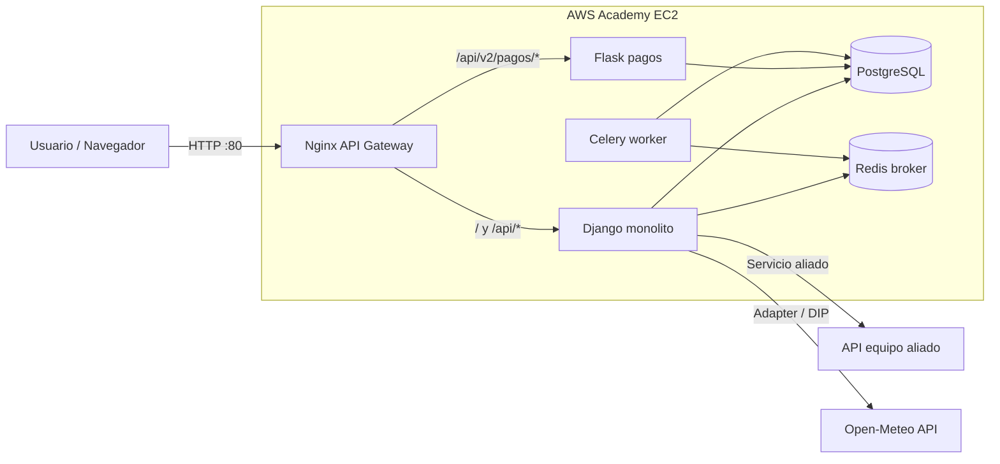

# Arquitectura - Entregable 2

Este documento resume la arquitectura objetivo para la sustentacion. La IP elastica de AWS y la URL real del equipo aliado se deben completar cuando esten disponibles.

## Vista de despliegue

## Strangler Pattern

- El monolito Django conserva UI, usuarios, reservas e integraciones.
- La funcionalidad de pagos se expone tambien como microservicio Flask en `/api/v2/pagos/`.
- Nginx enruta `/api/v2/pagos/*` hacia Flask y el resto hacia Django.
- El frontend intenta usar primero el endpoint migrado de pagos y conserva fallback al endpoint Django.

## Servicios de integracion

- Servicio propio JSON: `GET /api/integraciones/resumen/`.
- Servicio aliado: `GET /api/integraciones/aliado/`, configurable con `ALLY_SERVICE_URL`.
- API de terceros: `GET /api/integraciones/tercero/`, implementada mediante Adapter sobre Open-Meteo.
- Vista de evidencia: `/integraciones/`.

## Resiliencia y asincronia

- Redis funciona como message broker.
- Celery ejecuta tareas de notificacion y reporte en segundo plano.
- Si Celery/Redis no esta disponible en desarrollo, los servicios mantienen fallback sincronico para no romper la experiencia.

## Pendientes externos

- Configurar IP elastica de AWS Academy.
- Reemplazar `ALLY_SERVICE_URL` por el endpoint real del equipo aliado.
- Mantener la instancia EC2 encendida para la sustentacion.
